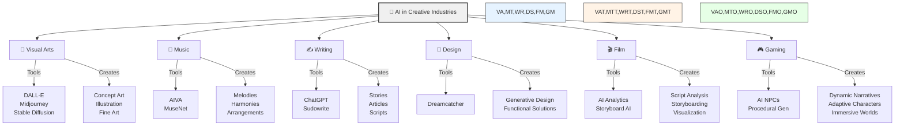

The Future of AI in Creative Industries

As artificial intelligence continues to evolve, its impact on creative workflows is becoming increasingly significant. From generative art to adaptive music composition, AI is not just automating tasks but enabling entirely new forms of creative expression.

---

**The Current Landscape**

The integration of AI in creative industries has experienced remarkable growth in recent years. In visual arts, tools like DALL-E, Midjourney, and Stable Diffusion have transformed concept art, illustration, and even fine art creation. Music composition has witnessed similar innovation, with platforms like AIVA and OpenAI's MuseNet empowering musicians to experiment with novel melodies, harmonies, and arrangements. Writers now leverage AI tools such as ChatGPT and Sudowrite to brainstorm, draft, and refine their work, resulting in enhanced productivity and sharper narratives. In design, generative tools like Autodesk's Dreamcatcher are reshaping the field, enabling innovative solutions that marry functionality with aesthetic appeal.

---

**Beyond Automation**

The true power of AI in creative endeavors lies not in mere automation but in its ability to augment human creativity. Acting as a creative collaborator, AI introduces suggestions and perspectives that may have otherwise been overlooked. This synergy between human intuition and machine learning is unlocking entirely new creative possibilities.

For example, in the world of filmmaking, AI-driven tools analyze scripts and audience trends to predict the potential success of a storyline. They assist in generating storyboards, streamlining the visualization process. In gaming, AI contributes to creating dynamic narratives and lifelike characters that adapt to player actions, fostering immersive and engaging experiences.

---

**Key Benefits**

AI empowers creators in profound ways. It facilitates rapid prototyping by generating multiple iterations of concepts within minutes, significantly accelerating the ideation process. By identifying successful patterns in existing creative works, it offers insights into audience preferences and emerging trends. Personalization has become more sophisticated, as AI tailors content to individual tastes, evident in AI-curated playlists on Spotify or personalized reading recommendations on platforms like Kindle. Furthermore, by automating tedious tasks such as editing, rendering, or resizing, AI liberates creators to focus on conceptual and higher-level work, fostering innovation and deeper engagement with their craft.

---

**Ethical Considerations**

The rise of AI in creative processes introduces essential ethical questions. One critical concern revolves around authenticity and originality, as the boundaries of authorship become increasingly blurred in AI-assisted works. The future of human creativity in a landscape dominated by AI-generated content prompts introspection about the role of innovation and cultural expression. Another pressing issue pertains to fair attribution and compensation, especially when AI models are trained on copyrighted material, potentially replicating specific elements unintentionally. As these technologies evolve, it is imperative to establish clear legislation and ethical guidelines to maintain a balance between innovation and fairness.

---

**Looking Forward**

The future of AI in creative industries is rooted in collaboration rather than replacement. When used responsibly, AI becomes an invaluable tool that amplifies human creativity while preserving the emotional and cultural depth that defines artistic expression. Emerging trends underscore this shift. Hybrid workflows, for instance, combine traditional craftsmanship with AI-generated enhancements, enabling artists to draft initial concepts with AI before refining them manually. Interactive experiences are also gaining traction, with responsive art installations powered by AI delivering dynamic, immersive encounters—from real-time adaptive visual effects in performances to AI-generated soundscapes in galleries. Collaborative creation represents another frontier, where AI systems adapt to the unique styles and preferences of individual creators, fostering deeper creative exploration.

---

**Conclusion**

The integration of AI into creative industries marks a transformative moment in the evolution of human ingenuity. By approaching these tools with curiosity and responsibility, creators can unlock unparalleled opportunities while preserving the authenticity and emotional resonance that make art meaningful. The key lies in embracing AI as a collaborator that enhances rather than diminishes the human touch in artistic endeavors.

---

Published: January 15, 2024

Author: Wassim Boubaker
Technical Lead & ML Engineer passionate about AI, creativity, and innovation.
